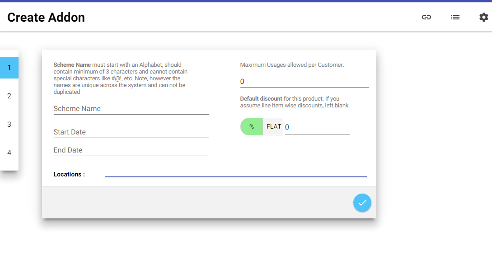

<<<<<<< HEAD

## Polymer Starter Kit

> A starting point for building web applications with Polymer 1.0

### Included out of the box:

* [Polymer](http://polymer-project.org), [Paper](https://elements.polymer-project.org/browse?package=paper-elements), [Iron](https://elements.polymer-project.org/browse?package=iron-elements) and [Neon](https://elements.polymer-project.org/browse?package=neon-elements) elements
* [Material Design](http://www.google.com/design/spec/material-design/introduction.html) layout
* Routing with [Page.js](https://visionmedia.github.io/page.js/)
* Unit testing with [Web Component Tester](https://github.com/Polymer/web-component-tester)
* Optional offline setup through [Platinum](https://elements.polymer-project.org/browse?package=platinum-elements) Service Worker elements
* End-to-end Build Tooling (including [Vulcanize](https://github.com/Polymer/vulcanize))

## Getting Started

To take advantage of Polymer Starter Kit you need to:

1. Get a copy of the code.
2. Install the dependencies if you don't already have them.
3. Modify the application to your liking.
4. Deploy your production code.

### Get the code

[Download](https://github.com/polymerelements/polymer-starter-kit/releases/latest) and extract Polymer Starter Kit to where you want to work.

The standard version of Polymer Starter Kit comes with tools that are very handy when developing a Polymer app. If you'd like to get started without installing any new tools, see Polymer Starter Kit Light in the [Releases](https://github.com/polymerelements/polymer-starter-kit/releases/latest) page.

### Install dependencies

#### Quick-start (for experienced users)

With Node.js installed, run the following one liner from the root of your Polymer Starter Kit download:

```sh
npm install -g gulp bower && npm install && bower install
```

#### Prerequisites (for everyone)

The full starter kit requires the following major dependencies:

- Node.js, used to run JavaScript tools from the command line.
- npm, the node package manager, installed with Node.js and used to install Node.js packages.
- gulp, a Node.js-based build tool.
- bower, a Node.js-based package manager used to install front-end packages (like Polymer).

**To install dependencies:**

1)  Check your Node.js version.

```sh
node --version
```

The version should be at or above 0.12.x.

2)  If you don't have Node.js installed, or you have a lower version, go to [nodejs.org](https://nodejs.org) and click on the big green Install button.

3)  Install `gulp` and `bower` globally.

```sh
npm install -g gulp bower
```

This lets you run `gulp` and `bower` from the command line.

4)  Install the starter kit's local `npm` and `bower` dependencies.

```sh
cd polymer-starter-kit && npm install && bower install
```

This installs the element sets (Paper, Iron, Platinum) and tools the starter kit requires to build and serve apps.

### Development workflow

#### Serve / watch

```sh
gulp serve
```

This outputs an IP address you can use to locally test and another that can be used on devices connected to your network.

#### Run tests

```sh
gulp test:local
```

This runs the unit tests defined in the `app/test` directory through [web-component-tester](https://github.com/Polymer/web-component-tester).

#### Build & Vulcanize

```sh
gulp
```

Build and optimize the current project, ready for deployment. This includes linting as well as vulcanization, image, script, stylesheet and HTML optimization and minification.

## Application Theming

Polymer 1.0 introduces a shim for CSS custom properties. We take advantage of this in `app/styles/app-theme.html` to provide theming for your application. You can also find our presets for Material Design breakpoints in this file.

[Read more](https://www.polymer-project.org/1.0/docs/devguide/styling.html) about CSS custom properties.

## Unit Testing

Web apps built with Polymer Starter Kit come configured with support for [Web Component Tester](https://github.com/Polymer/web-component-tester) - Polymer's preferred tool for authoring and running unit tests. This makes testing your element based applications a pleasant experience.

[Read more](https://github.com/Polymer/web-component-tester#html-suites) about using Web Component tester.

## Dependency Management

Polymer uses [Bower](http://bower.io) for package management. This makes it easy to keep your elements up to date and versioned. For tooling, we use npm to manage Node.js-based dependencies.

## Service Worker

Polymer Starter Kit offers an optional offline experience thanks to Service Worker and the [Platinum Service Worker elements](https://github.com/PolymerElements/platinum-sw). New to Service Worker? Read the following [introduction](http://www.html5rocks.com/en/tutorials/service-worker/introduction/) to understand how it works.

Our optional offline setup should work well for relatively simple applications. For more complex apps, we recommend learning how Service Worker works so that you can make the most of the Platinum Service Worker element abstractions.

### Enable Service Worker support?

To enable Service Worker support for Polymer Starter Kit project use these 3 steps:

1. Uncomment Service Worker code in index.html
  ```HTML
  <!-- Uncomment next block to enable Service Worker support (1/2) -->
  <!--
  <paper-toast id="caching-complete"
               duration="6000"
               text="Caching complete! This app will work offline.">
  </paper-toast>

  <platinum-sw-register auto-register
                        clients-claim
                        skip-waiting
                        on-service-worker-installed="displayInstalledToast">
    <platinum-sw-cache default-cache-strategy="networkFirst"
                       precache-file="precache.json">
    </platinum-sw-cache>
  </platinum-sw-register>
  -->
  ```
2. Uncomment Service Worker code in elements.html

  ```HTML
  <!-- Uncomment next block to enable Service Worker Support (2/2) -->
  <!--
  <link rel="import" href="../bower_components/platinum-sw/platinum-sw-cache.html">
  <link rel="import" href="../bower_components/platinum-sw/platinum-sw-register.html">
  -->
  ```
3. Add 'precache' to the list in the 'default' gulp task like below.
[(gulpfile.js)](https://github.com/PolymerElements/polymer-starter-kit/blob/master/gulpfile.js)

  ```JavaScript
  // Build Production Files, the Default Task
  gulp.task('default', ['clean'], function (cb) {
    runSequence(
      ['copy', 'styles'],
      'elements',
      ['jshint', 'images', 'fonts', 'html'],
      'vulcanize', 'precache',
      cb);
  });
  ```

#### Filing bugs in the right place

If you experience an issue with Service Worker support in your application, check the origin of the issue and use the appropriate issue tracker:

* [sw-toolbox](https://github.com/GoogleChrome/sw-toolbox/issues)
* [platinum-sw](https://github.com/PolymerElements/platinum-sw/issues)
* [platinum-push-notifications-manager](https://github.com/PolymerElements/push-notification-manager/)
* For all other issues, feel free to file them [here](https://github.com/polymerelements/polymer-starter-kit/issues).

#### I get an error message about "Only secure origins are allowed"

Service Workers are only available to "secure origins" (HTTPS sites, basically) in line with a policy to prefer secure origins for powerful new features. However http://localhost is also considered a secure origin, so if you can, developing on localhost is an easy way to avoid this error. For production, your site will need to support HTTPS.

#### How do I debug Service Worker?

If you need to debug the event listener wire-up use `chrome://serviceworker-internals`.

#### What are those buttons on chrome://serviceworker-internals?

This page shows your registered workers and provides some basic operations.

* Unregister: Unregisters the worker.
* Start: Starts the worker. This would happen automatically when you navigate to a page in the worker's scope.
* Stop: Stops the worker.
* Sync: Dispatches a 'sync' event to the worker. If you don't handle this event, nothing will happen.
* Push: Dispatches a 'push' event to the worker. If you don't handle this event, nothing will happen.
* Inspect: Opens the worker in the Inspector.

#### Development flow

In order to guarantee that the latest version of your Service Worker script is being used, follow these instructions:

* After you made changes to your service worker script, close all but one of the tabs pointing to your web application
* Hit shift-reload to bypass the service worker as to ensure that the remaining tab isn't under the control of a service worker
* Hit reload to let the newer version of the Service Worker control the page.

If you find anything to still be stale, you can also try navigating to `chrome:serviceworker-internals` (in Chrome), finding the relevant Service Worker entry for your application and clicking 'Unregister' before refreshing your app. This will (of course) only clear it from the local development machine. If you have already deployed to production then further work will be necessary to remove it from your user's machines.

#### Disable Service Worker support after you enabled it

If for any reason you need to disable Service Worker support after previously enabling it, you can remove it from your Polymer Starter Kit project using these 4 steps:

1. Remove references to the platinum-sw elements from your application [index](https://github.com/PolymerElements/polymer-starter-kit/blob/master/app/index.html).
2. Remove the two Platinum Service Worker elements (platinum-sw/..) in [app/elements/elements.html](https://github.com/PolymerElements/polymer-starter-kit/blob/master/app/elements/elements.html)
3. Remove 'precache' from the list in the 'default' gulp task ([gulpfile.js](https://github.com/PolymerElements/polymer-starter-kit/blob/master/gulpfile.js))
4. Navigate to `chrome://serviceworker-internals` and unregister any Service Workers registered by Polymer Starter Kit for your app just in case there's a copy of it cached.

## Yeoman support

[generator-polymer](https://github.com/yeoman/generator-polymer/releases) now includes support for Polymer Starter Kit out of the box.

## Frequently Asked Questions

### Where do I customise my application theme?

Theming can be achieved using [CSS Custom properties](https://www.polymer-project.org/1.0/docs/devguide/styling.html#xscope-styling-details) via [app/styles/app-theme.html](https://github.com/PolymerElements/polymer-starter-kit/blob/master/app/styles/app-theme.html).
You can also use `app/styles/main.css` for pure CSS stylesheets (e.g for global styles), however note that Custom properties will not work there under the shim.

A [Polycast](https://www.youtube.com/watch?v=omASiF85JzI) is also available that walks through theming using Polymer 1.0.

### Where do I configure routes in my application?

This can be done via [`app/elements/routing.html`](https://github.com/PolymerElements/polymer-starter-kit/blob/master/app/elements/routing.html). We use Page.js for routing and new routes
can be defined in this import. We then toggle which `<iron-pages>` page to display based on the [selected](https://github.com/PolymerElements/polymer-starter-kit/blob/master/app/index.html#L105) route.

### Why are we using Page.js rather than a declarative router like `<more-routing>`?

`<more-routing>` (in our opinion) is good, but lacks imperative hooks for getting full control
over the routing in your application. This is one place where a pure JS router shines. We may
at some point switch back to a declarative router when our hook requirements are tackled. That
said, it should be trivial to switch to `<more-routing>` or another declarative router in your
own local setup.

### Where can I find the application layouts from your Google I/O 2015 talk?

App layouts live in a separate repository called [app-layout-templates](https://github.com/PolymerElements/app-layout-templates).
You can select a template and copy over the relevant parts you would like to reuse to Polymer Starter Kit.

You will probably need to change paths to where your Iron and Paper dependencies can be found to get everything working.
This can be done by adding them to the [`elements.html`](https://github.com/PolymerElements/polymer-starter-kit/blob/master/app/elements/elements.html) import.

### Something has failed during installation. How do I fix this?

Our most commonly reported issue is around system permissions for installing Node.js dependencies.
We recommend following the [fixing npm permissions](https://github.com/sindresorhus/guides/blob/master/npm-global-without-sudo.md)
guide to address any messages around administrator permissions being required. If you use `sudo`
to work around these issues, this guide may also be useful for avoiding that.

If you run into an exception that mentions five optional dependencies failing (or an `EEXIST` error), you
may have run into an npm [bug](https://github.com/npm/npm/issues/6309). We recommend updating to npm 2.11.0+
to work around this. You can do this by opening a Command Prompt/terminal and running `npm install npm@2.11.0 -g`. If you are on Windows,
Node.js (and npm) may have been installed into `C:\Program Files\`. Updating npm by running `npm install npm@2.11.0 -g` will install npm
into `%AppData%\npm`, but your system will still use the npm version. You can avoid this by deleting your older npm from `C:\Program Files\nodejs`
as described [here](https://github.com/npm/npm/issues/6309#issuecomment-67549380).

If the issue is to do with a failure somewhere else, you might find that due to a network issue
a dependency failed to correctly install. We recommend running `npm cache clean` and deleting the `node_modules` directory followed by
`npm install` to see if this corrects the problem. If not, please check the [issue tracker](https://github.com/PolymerElements/polymer-starter-kit/issues) in case
there is a workaround or fix already posted.

### I'm having trouble getting Vulcanize to fully build my project on Windows. Help?

Some Windows users have run into trouble with the `elements.vulcanized.html` file in their `dist` folder
not being correctly vulcanized. This can happen if your project is in a folder with a name containing a
space. You can work around this issue by ensuring your path doesn't contain one.

There is also an [in-flight](https://github.com/PolymerElements/polymer-starter-kit/issues/62#issuecomment-108974016) issue
where some are finding they need to disable the `inlineCss` option in our configuration for Vulcanize
to correctly build. We are still investigating this, however for the time-being use the workaround if
you find your builds getting stuck here.


### How do I add new JavaScript files to Starter Kit so they're picked up by the build process?

At the bottom of `app/index.html`, you will find a build block that can be used to include additional
scripts for your app. Build blocks are just normal script tags that are wrapped in a HTML
comment that indicates where to concatenate and minify their final contents to.

Below, we've added in `script2.js` and `script3.js` to this block. The line
`<!-- build:js scripts/app.js -->` specifies that these scripts will be squashed into `scripts/app.js`
during a build.

```html
<!-- build:js scripts/app.js -->
<script src="scripts/app.js"></script>
<script src="scripts/script2.js"></script>
<script src="scripts/script3.js"></script>
<!-- endbuild-->
```

If you are not using the build-blocks, but still wish for additional files (e.g scripts or stylesheets) to be included in the final `dist` directory, you will need to either copy these files as part of the gulpfile.js build process (see the `copy` task for how to automate this) or manually copy the files.

### I'm finding the installation/tooling here overwhelming. What should I do?

Don't worry! We've got your covered. Polymer Starter Kit tries to offer everything you need to build and optimize your apps for production, which is why we include the tooling we do. We realise however that our tooling setup may not be for everyone.

If you find that you just want the simplest setup possible, we recommend using Polymer Starter Kit light, which is available from the [Releases](https://github.com/PolymerElements/polymer-starter-kit/releases) page. This takes next to no time to setup.

## Contributing

Polymer Starter Kit is a new project and is an ongoing effort by the Web Component community. We welcome your bug reports, PRs for improvements, docs and anything you think would improve the experience for other Polymer developers.
=======
----------


Callhealth


----------


Software Requirements Specification
===================================


----------


Pricing Engine
--------------
Guided by:  Suresh KumaraSubramaniam 
*(suresh.kumarasubramaniam@callhealth.com)*


----------


10-April-2015
<table>
  <tr>
    <td colspan=3>Pricing Engine v_1.0</td>
  </tr>
  <tr>
    <td></td>
    <td></td>
    <td></td>
    <td></td>
  </tr>
  <tr>
    <td></td>
    <td>Prepared by</td>
    <td>Reviewed by</td>
    <td>Approved by</td>
  </tr>
  <tr>
    <td>Name</td>
    <td>Siva P Tumma</td>
    <td>Suresh KS</td>
    <td>Suresh KS</td>
  </tr>
  <tr>
    <td>Designation</td>
    <td>Developer Architect</td>
    <td>Delivery Manager</td>
    <td>Delivery Manager</td>
  </tr>
  <tr>
    <td>Signature</td>
    <td>Siva.Tumma@callhealth.com</td>
    <td>suresh.kumarasubramaniam@callhealth.com</td>
    <td>suresh.kumarasubramaniam@callhealth.com</td>
  </tr>
</table>


# **Revision History**

<table>
  <tr>
    <td>Date</td>
    <td>Description</td>
    <td>Author</td>
    <td>Comments</td>
  </tr>
  <tr>
    <td>10-APR-15</td>
    <td>1.0</td>
    <td>Siva Prasad Tumma</td>
    <td>First Release</td>
  </tr>
  <tr>
    <td>29-JUN-15</td>
    <td>1.1</td>
    <td>KM Sivakumar</td>
    <td>Updated Front-end Use Cases</td>
  </tr>
  <tr>
    <td></td>
    <td></td>
    <td></td>
    <td></td>
  </tr>
  <tr>
    <td></td>
    <td></td>
    <td></td>
    <td></td>
  </tr>
</table>


# **Document Approval**

The following Software Requirements Specification has been accepted and approved by the following:

<table>
  <tr>
    <td>Signature</td>
    <td>Printed Name</td>
    <td>Title</td>
    <td>Date</td>
  </tr>
  <tr>
    <td>suresh.kumarasubramaniam@callhealth.com</td>
    <td>Suresh K Subramaniam</td>
    <td>Software Delivery Manager</td>
    <td></td>
  </tr>
  <tr>
    <td></td>
    <td></td>
    <td></td>
    <td></td>
  </tr>
</table>


					

**Table of Contents**

[[TOC]]

## [Definitions, Acronyms, and Abbreviations](#h.7kkvtfc6fwhl)

<table>
  <tr>
    <td>S.No</td>
    <td>Terms</td>
    <td>Definition</td>
  </tr>
  <tr>
    <td>1.</td>
    <td>L1/CCO</td>
    <td>Call Centre Officer</td>
  </tr>
  <tr>
    <td>2.</td>
    <td>L2</td>
    <td>Consultant - Specialist</td>
  </tr>
  <tr>
    <td>3</td>
    <td>POP</td>
    <td>Point of Presence Admin</td>
  </tr>
  <tr>
    <td>4.</td>
    <td>MHO</td>
    <td>Mobile Health Officer</td>
  </tr>
  <tr>
    <td>5.</td>
    <td>DDA</td>
    <td>Drug Delivery Agent</td>
  </tr>
  <tr>
    <td>6.</td>
    <td>HHO</td>
    <td>Home Health Officer</td>
  </tr>
  <tr>
    <td>7.</td>
    <td>MRN</td>
    <td>Medical Record Number</td>
  </tr>
  <tr>
    <td>8.</td>
    <td>HPI</td>
    <td>History of Present Illness</td>
  </tr>
  <tr>
    <td>9.</td>
    <td>PMHx</td>
    <td>Past Medical History</td>
  </tr>
  <tr>
    <td>10.</td>
    <td>SOAP</td>
    <td>Subjective, Objective, Assessment and Plan</td>
  </tr>
  <tr>
    <td>11.</td>
    <td>COD</td>
    <td>Cash on Delivery</td>
  </tr>
  <tr>
    <td>12.</td>
    <td>ACD</td>
    <td>Automatic Call Distribution</td>
  </tr>
  <tr>
    <td>13.</td>
    <td>ICD</td>
    <td>International Classification of Diseases</td>
  </tr>
  <tr>
    <td>15.</td>
    <td>EHR</td>
    <td>Electronic Health Record</td>
  </tr>
  <tr>
    <td>16.</td>
    <td>EMR</td>
    <td>Electronic Medical Record</td>
  </tr>
  <tr>
    <td>17.</td>
    <td>CC</td>
    <td>Chief Complaints</td>
  </tr>
  <tr>
    <td>18.</td>
    <td>DO</td>
    <td>Delivery Order</td>
  </tr>
  <tr>
    <td>19</td>
    <td>HO</td>
    <td>Health Officer</td>
  </tr>
</table>


# **1. Introduction**

Pricing Engine is a software product to facilitate the creation and orchestration of Schemes around health care services. On its own, It must be a lightweight application that is scalable. It will form a layer on top of internal business systems of Callhealth private limited; and the customers of Schemes. A CCO will form a point of contact between the overall functional system.

## **1.1 Purpose**

The current document address the conformity of the specific requirements that MUST be delivered as a core software product along with any artifacts that would be agreed upon subsequently. This document will be called as an "SRS Document" for Callhealth Pricing Engine application and the intended audiences for this document are

* Callhealth Business

* Internal system Leads who are linked with Pricing Engine

* Leads working with RT-Medibus application

* Leads working with Associate Portal

* Leads working with Customer Portal

* Leads working with E-Wellness Platform

* QA Leads linked with Pricing Engine Quality Assurance

* Subsequent product owners those have products as part of their software and wish to utilize to get benefited by Callhealth marketing strategy through Scheme creation and Orchestration

## **1.2 Scope**

**Pricing Engine would be comprised of the following**

1. Host a NOSQL Database specific to this product,

2. Database Schema that suits the current specification requirements

3. Host a Server that speaks HTTP(S) 

4. Web server Module that contains business logic along with REST API

5. Would serve as a REST API for different clients including internal software systems

6. REST API support for Report Generations, Analysis

**Pricing Engine will NOT**

* Indulge into the existing Platform providers viz, RT-Medibus, Associate Portal, etc

* Contain an RDBMS that can be accessed either directly or indirectly 

* Take care of direct billing and invoicing. (As of this writing)

**Pricing Engine will enable its users the following broaderuse-cases to be fulfilled**

* A Web enabled REST API that can be accessed with specific access to create, modify, publish Schemes & Coupons

* A minimalist but complete browser based User interface that facilitates business users to create Schemes, view existing Schemes, publish them

* Only authorized users would be able to create and publish Schemes/coupons.

## **1.3 References**

1. MediBus_Package_Schemes _Coupon_V2.docx.

2. Service_policies_Rates_Schemes_draft_2014_09_22.docx.

3. Architecture_Document_Pricing_Engine_v0.1

Most of the above documents have been in circulation for concerned people and can also be obtained from [siva.tumma@callhealth.com](mailto:siva.tumma@callhealth.com) or [suresh.kumarasubramaniyam@callhealth.com](mailto:suresh.kumarasubramaniyam@callhealth.com) if required

## **1.4. Overview**

The current document defines the high level goals for developing the Pricing Engine product for Callhealth’s assumed functionality called **Scheme** creation and orchestration. It also addresses the required standards to be incorporated for a smoother development life cycle. It tries to put the use cases to solve and the concerns involved while getting them done.

# **2. General Description**

Pricing Engine is thought of a REST server with access for client applications and internal business systems through HTTP(S). The primary goal of this product is scalability, in terms of data storage and availability. Designated roles must also be able to read from and write to its persistence storage.

## **2.1 Product Perspectives**

**As thought from RT-Medibus platform provider**

The RT-Medibus platform has a rich thought process put into itself that is able to let the business users to

* Group Items & Item services as "Packages"

* Segregate Packages into Rate Categories & Service Rate Categories

* Billing & Invoice the Customers

Henceforth, RT-Medibus can call Pricing Engine’s REST API to 

* Identify the published Schemes and Coupons 

* Talk to Pricing Engine to know the Coupon wise discounts to bill customers

* Can understand the Scheme behavior and apply that to fine-grain its own billing modules.

**As thought from Associate Portal platform provider**

There is an ask to club the Schemes with abilities to link Service Rate Categories Rate Categories, Packages that are Associate specific

* Pricing Engine might allow Associates to create & publish Scheme creation and coupon creations specific to their interests through Call-health platform.

* Pricing Engine might communicate to Associate Portal to know about associates

**As thought from an end-user who wish to consume the services**

* An end user can see Schemes and coupons available through web clients, mobile clients and / or, hand-held devices

* An end user might wish to opt for services and Schemes there and then if a Scheme or coupon seemed suit for their requirement

## **2.2 Product Functions**

**The Pricing Engine as a product, Should:**

1. Allow Callhealth Business users to create Schemes

2. Allow Callhealth Business users to create Coupons & Gift Cards 

3. Allow Callhealth Business users to define the behavior of a Scheme through "Rules"

4. Allow Callhealth Business users to define discount on Services

5. Allow Callhealth Business users to publish the created Schemes

6. Allow Internal Business systems of Callhealth Pvt ltd to communicate for Schemes & Coupons for their billing & Invoice generation requirements

7. Contain a browser based Graphical User Interface that facilitate points ‘1’ through ‘5’ above.

## **2.3 Other System Characteristics that are affected**

* Internal Business systems viz., RT-Medibus & Associate Portal and the likes must plan and effort for communication logic to talk to Pricing Engine

* They also must understand the JSON structures of communication for any specific API call

## **2.4 General Constraints**

* As of this writing, there are other systems to communicate to, that are mostly designed and developed on top of planned, tightly coupled RDBMSs. For the Pricing Engine to run alongside within their process areas would be time consuming and difficult in many ways. Henceforth, Pricing Engine is built like a RESTful server so that businesses themselves consume the API

* There are complex systems that mostly are inter-dependent, that use Technical Competencies different from each other to solve their scenarios. To make intercommunication between those systems possible, We need to have a common architecture that serves purposes of all the systems involved. One example is to create an MDM, meant for Master Data Management system. This is not realized as of this writing.

## **2.5 Assumptions and Dependencies**

The following are the current Assumptions in Pricing Engine’s context

1. It is agreed by all stakeholders on the communication philosophy. (HTTPS) 

2. The finance department has already configured Service Rate Categories which classifies discounts per product categories

3. RT-Medibus will be able to give the following information:

    1. **Service Rate Category List - Each is Unique, along with their names**

    2. **User IDs at the time of billing to track who used a scheme and when**

    3. **Calculated Amount for a current order prior to applying a coupon**

4. Any system that wishes to use Pricing Engine’s API must use JSON as the data exchange format.

5. RT-Medibus application will use HTTPS to talk to Pricing Engine’s API

6. Associate Portal application will allow Pricing Engine to talk to it through HTTP(S)

7. A scalable infrastructure will be available for the deployment of Pricing Engine.

# **3. Specific Requirements**

## **3.1 External Interface Requirements**

### **3.1.1. Browser based User Interface**

**3.1.1 (a) Login Screen**

This must facilitate a pre-registered business user to login to the system and let them see the available operations for their roles. As of this writing, User accounts are planned to be created by Dev-ops teams and communicate to specific business users upon official request. They should be able to Signout, but may not do their user management themselves.

The look and feel for this screen should appropriately look like the following.


**3.1.1 (b) Scheme Creation Screen **

The business users must be able to create Schemes, coupons. They should also be able to specify behavior on the Schemes and should be able to publish them by themselves. Users should be able to save a Scheme for editing later, before publishing. Once a Scheme is published, it can not be altered, but can be expired. Every Scheme must be persisted forever to understand historical behavior of Scheme reach among consumers and to understand how to improve the rules efficiently for business.

Small background of Scheme Creation: A scheme will be created by the Marketing department. Before that, a considerable work would have already been done segregating different rate class products and their offered discounts into what is called as **Service Rate Categories;** by the Finance department. Since those systems have considerable amount of complexity, the Scheme creation and orchestration had been separated to another work-flow project and we need to communicate to Finance department systems while doing so. RT-Medibus provides interfaces to Finance departments.

The following is an initial depiction of Scheme creation UI with minimum required parameters.




To Be Documented

On this screen, The marketing user who has logged In, should be able to create a new Scheme. The following rules govern Scheme creation.

1. The Scheme name should be typed into a Text input box

2. The Scheme type must be selected. It can be either of **Add-On** or **Coupon,** or a **Gift_Card**

3. A start date for the Scheme must be entered through a date picker UI component

4. An end date which marks the expiration date of a Scheme must be picked and entered through a date picker UI component.

5. User should be able to enter discount into a Text box

6. The Service Rate Classes must be dynamically populated and should be in a selectable UI component. User should be able to select a Service Rate Class and attach to a Scheme.

7. The Service Rate Categories information should be in sync with what **RT-Medibus** systems has in place. A scheme creator will only use them and attach to Coupon or an Add-On

8. RT-Medibus will provide a URL for Pricing Engine to get service rate category information

    1. http://&lt;host&gt;/api/get/serviceRateCategories

9. User should be able to create a Scheme by pressing **Create** button. This must persist the Scheme data to underlying datastore.


### **3.1.2 Hardware Interfaces**

1. All instances should be deployed under latest stable Ubuntu based versions, 64 bit processor + OS architectures

2. Web server modules that are part of Pricing Engine should be able to be deployed in a clustered environment

3. Web server modules MUST be accessible through HTTP(S)

4. Web server machines should not open any port other than 80, 443 unless otherwise required by any other communicated features. (It is foreseen that only 443 would be open, for production)

5. Datastore servers should be able to be deployed in a clustered, fault tolerant environment.

6. Datastore servers should NOT be accessible from public traffic.

7. Datastore instances shall not open any port other than they are meant for.

8. Only Load Balancers will be communicated with each other to make sure any kind of replications happen and the load is balanced across configured and available infrastructure

9. Infrastructure should efficiently use resources and effortlessly take care of delegating to underlying instances.

### **3.1.3 Software Interfaces**

1. Database - MongoDB; This is NoSQL database (**version 3.0.2**)

2. Data Schema helper utilities - Mongoose

3. Web server Module - Nodejs (**version 0.10.37**)

4. REST API helper module - Express Js

5. Front-End development - Bootstrap + Jquery + Angular-JS

### **3.1.4 Communications Interfaces**

The complete REST API is described in a separate document. It should be used in companion with this document.

## **3.2 Functional Requirements**

These are the basic functions Pricing Engine should have. The Pricing Engine should be extensible, as there are a foreseen set of requirements coming in with short notices.

### 3.2.1	Authorization

As on date, the pricing engine is not required to enable direct user registrations. It is assumed that an LDAP integration would be done with Pricing Engine, and that the roles will be available to restrict operations. Nonetheless the user management would be done by the Pricing Engine dev-ops teams to facilitate all functionality. Currently the only users that access Pricing Engine’s UI are business users to create Schemes and publish them for orchestration between consumers and systems. The authorization process thus, will 

* Contain UI to let business users to log-in to the application

* The look & feel is shown in section 3.1.1 (a)

* User credentials will be created by Dev-Ops teams upon official request and will be communicated over email to the concerned people

**Note about session:** After successful login user will be shown View Schemes Screen. If user is in inactive in any screen for about 15 minutes, the user session will expire and the user is required to login again. The application will facilitate this through redirection.

For each and every request to server the session time will be updated. When the user is in inactive state, only then the user will automatically be logged out and displayed the following  message.

    

The above session time is based on the token_expires time,the token_expires key will be available for whole application once user logged in. The following is a screenshot from browser devtools for an example.

1. **token:**

2. 2767dfa9-dda1-49ee-87d9-1624cc86dfbb

3. **token_created:**

4. Tue Jun 30 2015 12:44:11 GMT+0530 (India Standard Time)

5. **token_expires:**

6. Tue Jun 30 2015 12:59:11 GMT+0530 (India Standard Time)

### 3.2.1.1 Currently Supported Roles:

1. **Creator:** Creator can only create scheme or coupon or gift card with save button

2. **Editor:** Editor can only edit the published or unpublished scheme/coupon/gift card

3. **Publisher:** Publisher can publish the scheme/coupon/gift card with publishing button

### 3.2.2 Create Scheme

* Contain UI to let business users to **create** Schemes

* Upon successful creation of a Scheme, the system will persist the Scheme for orchestrating and billing purposes.

* Contain UI to let business users to **modify** their intermediate Schemes

### 3.2.3 Create Coupon

* The UI must have controls to let business users to create Coupons

* A Coupon is a type of Scheme that has a discount on some Service Rate Categories

* The created Scheme(Coupon) must be persisted to the datastore for billing and orchestration purposes.

* The initial screen for create coupon is showing below

* The scheme type must be coupon


To Be Documented

### 3.2.4 Create a Gift Card

* The UI must have controls to let business users to create Giftcards

* The Gift Card Name should be in Text box.

* The Gift Card type should be selected as a Gift Card.

* The Gift Card is having start date and End Date. 

* Enter in the discount text box and choose the discount type.

* The initial screen for create gift card is showing below


### 3.2.5 Edit any scheme

  A scheme can be edited with edit button which is provided in view schemes screen. 


### 3.2.6 Publish Schemes

* UI should let business users to **publish** the already created Schemes

* This is intended for review purposes before releasing a Scheme

### 3.2.7 Publish Coupons

* UI should let business users to **publish** the already created Coupons

* This is intended for review purposes before releasing a Coupon

## **3.3. Non-Functional Requirements**

### **3.3.1 Performance**

1. 99.99% of the Requests should be served in a uniform time independent of number of concurrent requests. 

2. Response to the request should be ~500ms irrespective of the load on the server. The sizing would be appropriately updated based on the performance report.

### **3.3.2. Reliability**

1. All Release of Pricing engine would with Zero bugs (Critical/High). All Medium/Low bugs would be fixed within 2 weeks of release.

2. In case of system outage, the cluster will be down while the Operating system boots up and should take more than 5 minutes.

3. The system traffic will be monitored , with alerts enabled, such as CPU utilization, Memory utilization etc. 

### **3.3.3. Availability**

1. The system should be available 24 hours, 365 days a year.

2. The system should be available through default port 80 & 443 for all systems and users that communicate to it.

### **3.3.4. Security**

1. Any communication to Pricing Engine should happen over HTTPS in production

2. Only port 443 will be open on Web server modules in production

3. If a request is made to port 80 (general HTTP), The web server module should take care of redirecting it to 443, SSH to make sure the data transfer is being made in a secured manner.

4. Only 27017 port is open on Database servers in production

5. All business users must be authenticated before they can create or make changes to Schemes

### **3.3.5. Maintainability**

The Pricing Engine should be easily maintainable with a considerable amount of attention in terms of Resources, technical competency. However keeping in mind the requirements, We can keep dedicate resources to improve Pricing Engine as a product that evolves and solves upcoming usecases with minimum possible effort and time.

### **3.3.6. Portability**

1. Pricing Engine will support a Windows OS with minimum amount of configuration overhead, only for testing purposes.

2. Pricing Engine should be able to be deployed on any of *nix platforms like Ubuntu, GNU/Linux and be able to use dynamically available cloud platforms for deployment, storage purposes. 

## **3.4. Legal Requirements**

Unless it is REQUIRED and mentioned accordingly, all software components used to develop and build are Open source and Pricing Engine must clearly attribute towards their licenses, across development and production phases.

## **3.5. Design Constraints**

The Pricing Engine’s primary goal is to scale seamlessly in terms of Data storage capability, concurrency. The other systems that this system needed to provide services to are using design that are tightly coupled with RPC, RDBMS which restrict them to efficiently scale.

## **3.6. Logical Database Requirements**

1. Every Scheme (can be a Coupon too) will be persisted till 1 year.

2. After 1 year, Data must be backed up and kept for historical analysis that is required for business decisions to improve revenue.

3. In a single year, All Scheme names and Coupon names should be unique

4. After 1 year all old coupon names and Schemes names will expire and they can be ready for re-use

## **3.7. Other Requirements**

None as on date.

# **4. Analysis Models**

## **4.1 Sequence Diagrams**

	Please refer to Product_Architecture_Document_Pricing_Engine_v0.1

## **4.2. Data Flow Diagrams (DFD)**

	Please refer to Product_Architecture_Document_Pricing_Engine_v0.1

# **5. Change Management Process**

1. After the first release with the functionality specified in this document, Every new change that must be infused into the product must be officially approved over e-mail.

2. They must be properly analyzed, understood of the impact in terms of time to develop and towards external systems that interact with Pricing Engine

3. Feature and the impact should be communicated to all the stakeholders that intercommunicate (like RT-Medibus teams, Associate Portal teams)

4. Suresh.Kumarasubramaniyam@callhealth.com should approve a new feature or change to be incorporated; after followed approval from business.

**Appendices**

**Appendix A: Analysis Models**

		Please refer to accompanying Architecture document

**Appendix B: To Be Determined List**

* How to go about MDM ?

>>>>>>> b012b284db97a4cc369935cd70b9b5617e5e6ca8
